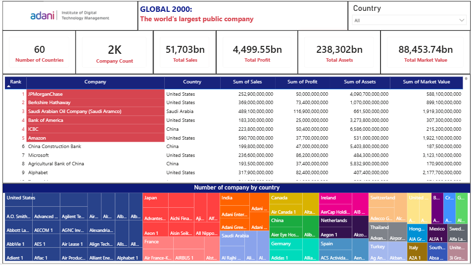
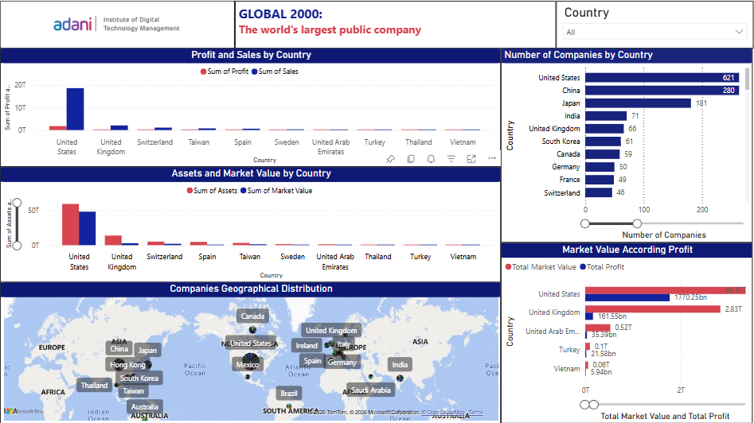
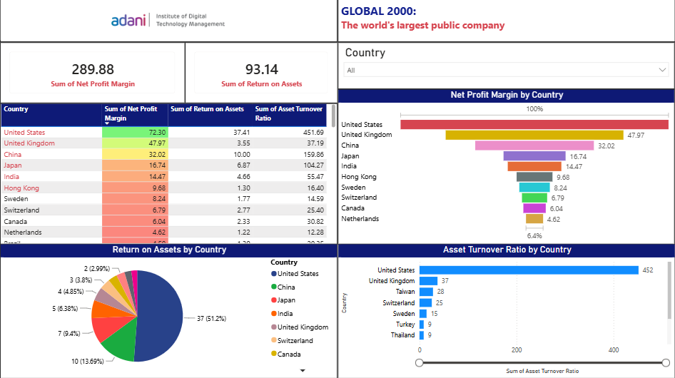
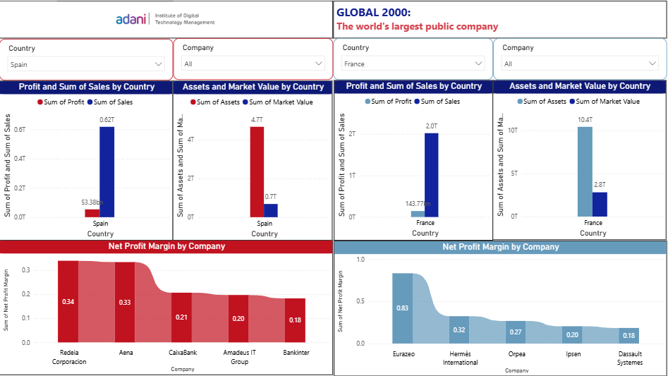
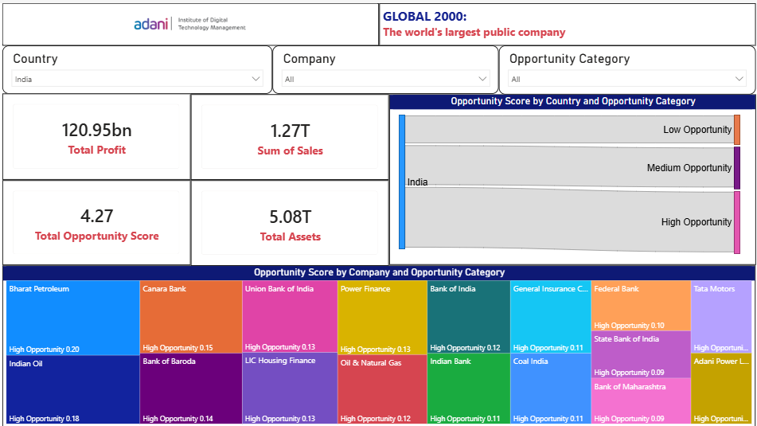

# Global 2000 Companies - Financial & Strategic Analysis

An interactive **Power BI Business Intelligence project** analyzing the world's 2,000 largest publicly traded companies across 60 countries.

The project uses financial and operational metrics such as **Sales, Profit, Assets, Market Value, Net Profit Margin, Return on Assets, Asset Turnover Ratio, and Opportunity Score** to understand global economic dominance, company performance, financial efficiency, and potential business opportunities.

---

## 📌 Project Overview

The **Global 2000 Companies Analysis** project transforms company-level financial data into interactive Power BI dashboards for exploring the global business landscape.

The analysis focuses on:

- Global company rankings
- Country-wise economic dominance
- Sales and profit comparison
- Assets and market value
- Company geographical distribution
- Profitability and efficiency ratios
- Opportunity scoring
- Country and company-level comparisons
- Strategic business and investment insights

---

## 🎯 Project Objectives

The main objectives of this project are:

- Identify top-performing companies and countries based on financial metrics
- Analyze the distribution of global economic power across countries
- Compare sales, profit, assets, and market value
- Understand profitability and operational efficiency
- Analyze financial ratios across different markets
- Identify companies with high business opportunity scores
- Compare developed and emerging markets
- Provide data-driven insights for strategic decision-making

---

## 🛠️ Tools & Technologies

| Technology | Purpose |
|---|---|
| **Power BI** | Dashboard development and visualization |
| **Power Query** | Data cleaning and transformation |
| **DAX** | Calculated measures and financial KPIs |
| **Microsoft Excel / Dataset** | Data source and preparation |

---

# Power BI Features Used

The project demonstrates several Power BI capabilities for interactive financial and strategic analysis.

## Interactive Slicers

- **Country Slicer** – Filter the report by country
- **Company Slicer** – Analyze individual companies
- **Opportunity Category Slicer** – Filter companies by High, Medium, or Low opportunity

## Visualizations

- **Clustered Bar Charts** – Compare financial metrics such as Sales vs Profit
- **Horizontal Bar Charts** – Compare countries and companies
- **Treemap** – Visualize company-level financial contribution
- **Donut/Pie Charts** – Show financial ratio distributions
- **Geographical Map** – Visualize the global distribution of companies
- **Tables** – Display detailed company and country-level metrics
- **KPI Cards** – Highlight key financial indicators
- **Interactive Filtering** – Dynamically update visuals based on selections

---

# 🖼️ Dashboard Preview

The Power BI report contains five analytical pages covering global company performance, country-level economic dominance, profitability and efficiency, company-level comparisons, and opportunity analysis.

<p align="center">
  
  
</p>

<p align="center">
  
  
</p>

<p align="center">
  
</p>

---

# Project Outcome

This project demonstrates how Power BI can transform a large global-company dataset into an interactive **financial and strategic decision-support system**.

The dashboard enables users to move from:

**Global Economic Analysis → Country Comparison → Company Analysis → Financial Efficiency → Opportunity Identification**

The project therefore demonstrates practical application of:

- **Business Intelligence**
- **Financial Analytics**
- **Data Visualization**
- **DAX**
- **Interactive Dashboard Development**
- **Strategic Decision-Making**

---

# Analysis Workflow

```text
Global 2000 Dataset
        ↓
Data Cleaning & Preparation
        ↓
Power Query
        ↓
Data Modeling
        ↓
DAX Measures
        ↓
Interactive Power BI Dashboards
        ↓
Financial & Strategic Analysis
        ↓
Business Insights
