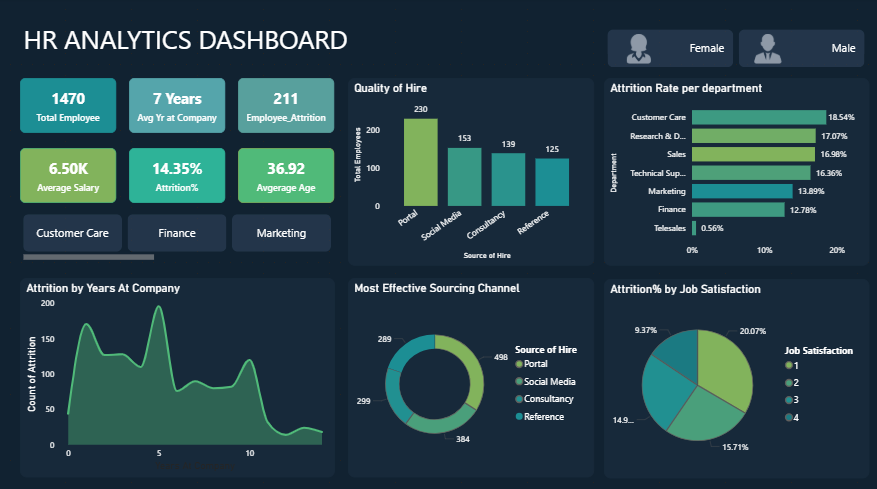

# HR Attrition & Workforce Analytics Dashboard

## 📊 Project Overview

The **HR Attrition & Workforce Analytics Dashboard** is an interactive Power BI project designed to analyze employee attrition, workforce characteristics, hiring sources, employee satisfaction, department-wise performance, and retention patterns.

The objective of this project is to transform employee data into meaningful business insights that can help HR teams and management make better decisions related to **employee retention, recruitment, workforce planning, and employee engagement**.

---

## 🎯 Project Objective

The main objective of this project is to analyze employee data and provide meaningful insights to help HR and management make data-driven decisions.

The dashboard focuses on:

- Understanding employee attrition patterns across departments and tenure
- Identifying effective hiring and sourcing channels
- Analyzing employee satisfaction and its relationship with attrition
- Comparing workforce and attrition across genders
- Identifying departments with high attrition and retention
- Understanding salary and attrition relationships
- Highlighting early-career employee exits
- Supporting better employee retention and workforce planning strategies

---

## 🛠️ Tools & Technologies

- **Power BI** – Dashboard development and data visualization
- **Power Query** – Data transformation and preparation
- **DAX** – KPI and analytical calculations
- **Data Analysis** – Workforce and attrition analysis

---

## 📌 Key Performance Indicators

The dashboard provides an overall workforce snapshot using important HR KPIs:

| KPI | Value |
|---|---:|
| Total Employees | 1,470 |
| Employee Attrition | 211 |
| Attrition Rate | 14.35% |
| Average Years at Company | 7 Years |
| Average Salary | ₹6.50K |
| Average Employee Age | 36.92 Years |

---

## 📈 Dashboard Analysis

### 1. Workforce Overview

The company has **1,470 employees**, with an average tenure of approximately **7 years**.

A total of **211 employees have left**, resulting in an overall attrition rate of **14.35%**.

The average employee age is approximately **37 years**, indicating a significant mid-career workforce.

### Business Insight

The attrition rate indicates that employee retention requires attention, particularly among employees in the early stages of their careers.

### Recommended Actions

- Introduce clear career progression paths
- Provide skill development and leadership training
- Review compensation and growth opportunities for mid-career employees
- Strengthen employee engagement initiatives

---

## 2. Most Effective Sourcing Channel

The analysis shows that **Job Portals are the most effective hiring source**, followed by Social Media and Consultancies.

Employee Referrals contribute comparatively fewer hires.

### Key Insight

Job portals provide the highest volume of hires, while the employee referral channel appears to be underutilized.

### Recommended Actions

- Simplify the employee referral process
- Introduce attractive referral incentives
- Promote successful referral stories internally
- Strengthen employer branding through social media
- Use consultancies strategically for critical or niche positions

---

## 3. Quality of Hire

The dashboard compares the number of employees hired through different sourcing channels.

| Source of Hire | Employees |
|---|---:|
| Job Portal | 230 |
| Social Media | 153 |
| Consultancy | 139 |
| Referral | 125 |

### Key Insight

Job portals contribute the highest number of hires, while employee referrals have the lowest contribution among the analyzed channels.

### Recommended Actions

- Strengthen employee referral programs
- Improve communication around referral benefits
- Enhance employer branding on social media
- Use recruitment consultancies selectively for specialized roles

---

## 4. Retention Rate by Department

Department-wise analysis highlights significant differences in employee retention.

**Tele-sales** has the highest retention rate at approximately **99.44%**, while **Customer Care** has the lowest retention rate at approximately **81.46%**.

### Key Insight

Customer Care has comparatively high employee turnover, whereas Tele-sales demonstrates strong employee retention.

### Possible Factors

Customer Care roles may involve:

- High workload
- Continuous customer interaction
- Stressful work environments
- Repetitive responsibilities

Tele-sales may benefit from:

- Clear targets
- Stable roles
- Incentive-based structures

### Recommended Actions

- Improve work-life balance in Customer Care
- Introduce stress-management initiatives
- Review workload and employee support
- Identify and replicate successful retention practices from Tele-sales

---

## 5. Attrition by Years at Company

The dashboard shows that employee attrition is particularly high during the **first 1–5 years** of employment.

After approximately 10 years, attrition decreases significantly.

### Key Insight

Early-career employee attrition is one of the major retention challenges identified in the analysis.

### Recommended Actions

- Improve onboarding and induction programs
- Introduce mentorship programs for new employees
- Conduct regular feedback sessions during the first two years
- Create clear career development paths
- Monitor early-tenure employee engagement

---

## 6. Employee Satisfaction & Attrition

The analysis indicates a relationship between employee satisfaction and attrition.

Employees with lower job satisfaction levels show comparatively higher attrition, while employees with higher satisfaction levels demonstrate better retention.

### Key Insight

Employee satisfaction is an important factor associated with workforce retention.

### Recommended Actions

- Conduct regular employee satisfaction surveys
- Improve manager-employee communication
- Introduce recognition and reward programs
- Identify employee concerns through feedback mechanisms
- Provide better career growth opportunities

---

## 7. Gender-Based Workforce & Attrition Analysis

The dashboard compares workforce distribution and attrition between male and female employees.

| Gender | Employees | Workforce Share | Attrition Rate |
|---|---:|---:|---:|
| Male | 882 | 60% | 15.19% |
| Female | 588 | 40% | 13.10% |

### Key Insight

Male employees represent approximately 60% of the workforce and have a higher attrition rate compared with female employees.

### Recommended Actions

- Conduct exit interviews to understand major attrition drivers
- Analyze department and role-level differences
- Ensure equal access to training and career development
- Monitor promotion and growth opportunities across the workforce

---

## 8. Department-wise Salary & Attrition Analysis

The dashboard compares employee count, average salary, and attrition rate across departments.

| Department | Employees | Average Salary | Attrition |
|---|---:|---:|---:|
| Customer Care | 178 | ₹6.81K | 18.54% |
| Tele-sales | 179 | ₹6.78K | 0.56% |
| R&D | 287 | ₹6.54K | 17.07% |
| Tech Support | 214 | ₹6.53K | 16.36% |
| Finance | 180 | ₹6.50K | 12.78% |
| Sales | 324 | ₹6.24K | 16.98% |
| Marketing | 108 | ₹6.15K | 13.89% |

### Key Insights

**Customer Care** has the highest average salary among the listed departments but still experiences high attrition.

This suggests that **salary alone may not be sufficient to retain employees**.

**Tele-sales and Finance** demonstrate relatively strong retention despite having mid-range salary levels.

### Recommended Actions

- Review compensation for Marketing and Sales
- Investigate non-financial factors affecting Customer Care attrition
- Analyze the workplace practices used by Finance and Tele-sales
- Apply successful retention practices across high-attrition departments

---

## 📊 Key Business Insights

The analysis identifies several important workforce patterns:

1. **Early-career attrition is a major concern**, particularly during the first 1–5 years.
2. **Employee satisfaction is strongly associated with attrition**, with lower satisfaction levels showing higher employee exits.
3. **Customer Care has one of the highest attrition rates**, requiring focused retention strategies.
4. **Tele-sales demonstrates exceptionally high retention**, providing an opportunity to identify successful retention practices.
5. **Job portals are the most effective hiring source** by hiring volume.
6. **Employee referrals are underutilized** compared with other sourcing channels.
7. **Salary alone does not explain employee retention**, as some departments experience high attrition despite relatively higher salaries.
8. **Male employees show a higher attrition rate** compared with female employees in the analyzed workforce.

---

## 💡 Business Recommendations

Based on the dashboard analysis, HR management can focus on the following areas:

### Employee Retention

- Strengthen onboarding and induction programs
- Introduce mentorship for new employees
- Build clear career progression paths
- Improve employee engagement and recognition

### Employee Satisfaction

- Conduct regular satisfaction surveys
- Improve manager-employee communication
- Introduce recognition and reward programs
- Address workload and workplace concerns

### Recruitment Strategy

- Continue leveraging high-performing job portals
- Strengthen employee referral programs
- Improve employer branding through social media
- Use consultancies for specialized hiring requirements

### Departmental Strategy

- Investigate high attrition in Customer Care, R&D, Sales, and Technical Support
- Study the retention practices used by Tele-sales and Finance
- Review salary competitiveness in departments with high attrition

---

## 📌 Overall Conclusion

The HR Attrition & Workforce Analytics Dashboard demonstrates how employee data can be transformed into actionable business insights.

The analysis highlights that **early-career attrition, employee satisfaction, department-level working conditions, and recruitment channels** are important areas for HR teams to monitor.

Rather than relying only on salary-based retention strategies, organizations can improve employee retention by combining **career development, employee engagement, effective onboarding, recognition, workplace improvements, and targeted departmental interventions**.

The dashboard can therefore support HR and management in making more informed decisions around **retention, recruitment, employee engagement, and workforce planning**.

---

## 🖼️ Dashboard Preview

